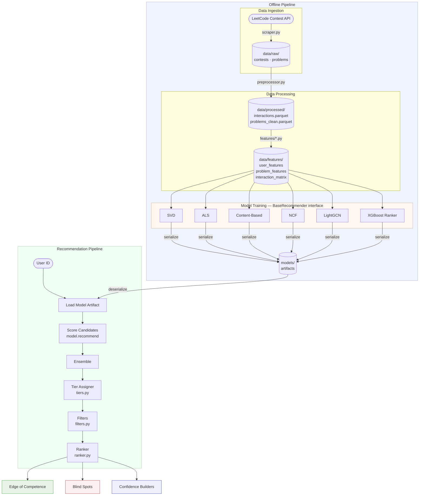

# System Design: LeetCode Recommendation System

| Field | Value |
|---|---|
| **Status** | Draft |
| **Authors** | LRS Team |
| **Last Updated** | 2026-04-12 |
| **Reviewers** | — |

---

## Overview

We are building a personalized skill-gap analyzer that predicts user performance on LeetCode problems and surfaces recommendations in three targeted tiers: **Edge of Competence**, **Blind Spots**, and **Confidence Builders**. Unlike recommenders that optimize for engagement, this system optimizes for learning — surfacing what a user *needs* rather than what they *like*. The design is organized around a modular model layer backed by a stable interface (`BaseRecommender`), so any model — from a simple SVD baseline to a graph neural network — can be swapped in or out without touching the tier assignment, evaluation, or serving logic.

---

## Background

Standard LeetCode recommenders treat the problem as "find similar problems to what the user has done." This is a content-based or collaborative filtering framing that optimizes for familiarity, not growth.

Our insight is that **contest data is richer than submission data**. A timed, competitive environment produces signals that a casual submission log cannot: how long a user takes relative to peers, how many wrong attempts they made under pressure, and which problem categories they underperform in despite similar overall ratings. Static difficulty labels (Easy / Medium / Hard) fail to capture this — a problem labeled "Medium" that consistently takes rated-1800 users 40 minutes is functionally harder than one that takes them 8 minutes.

This system uses those contest signals to build a skills model of the user and identify three distinct learning opportunities per recommendation request.

---

## Goals

- Ingest LeetCode contest data (~1M+ user-problem interactions across 50 contests) into a queryable feature store.
- Train and evaluate multiple model families (collaborative filtering, neural, graph-based, gradient-boosted) behind a single swappable interface.
- Produce per-user recommendations organized into three meaningful tiers, each serving a different learning objective.
- Evaluate model quality via offline temporal backtest using NDCG@10, Precision@10, and MRR.
- Support adding new model types without modifying the tier assignment, filtering, or evaluation code.

## Non-Goals

- **Real-time serving**: Batch recommendation generation is acceptable. Sub-second latency is not a requirement for this phase.
- **A user-facing UI or API endpoint**: This design covers the ML pipeline only. Serving infrastructure is future work.
- **Non-contest submission data**: Only contest participation records are in scope. Daily practice submissions are excluded.
- **Optimizing for engagement or problem completion rate**: The system does not optimize for what users are most likely to click or finish. It optimizes for skill development.
- **Automated retraining pipelines**: Scheduling and orchestration (Airflow, Prefect, etc.) are out of scope for V1.

---

## Design

### Principles

These rules govern every design decision below. When a tradeoff arises, use these to adjudicate.

**1. Model layer is interchangeable.**
All models implement `BaseRecommender` (`src/lrs/models/base.py`). No code outside `src/lrs/models/` may depend on model internals. Tier assignment, evaluation, and serving code call `model.recommend()` only.

**2. Tier logic is a business rule, not a model property.**
The three-tier strategy lives in `src/lrs/recommendation/`, not inside any model. A model produces scores; the tier assigner interprets them. Swapping models does not require touching tier logic.

**3. Raw data is immutable.**
`data/raw/` is append-only. No transformation writes back to it. All mutations happen in the preprocessing and feature layers. This makes the pipeline rerunnable and auditable.

**4. Separation of training-time and serving-time concerns.**
The data pipeline, feature store, and model training are offline processes. The recommendation pipeline consumes pre-trained artifacts. These two phases share no runtime state.

**5. Configuration over hardcoding.**
All thresholds (tier boundaries, candidate pool sizes, etc.) live in `src/lrs/config.py` and are overridable via environment variables. No magic numbers in business logic.

---

### Architecture Diagram

The system has two phases: an **offline pipeline** (data ingestion through model training) and a **recommendation pipeline** (loading trained artifacts to produce tier recommendations). The dashed boundary separates them.



---

### Component Breakdown

| Component | Location | Responsibility |
|---|---|---|
| **Scraper** | `src/lrs/data/scraper.py` | Fetch contest participation records from the LeetCode Contest API. Outputs immutable raw files. |
| **Preprocessor** | `src/lrs/data/preprocessor.py` | Clean and join raw data: normalize finish times, deduplicate submissions, compute `difficulty_proxy`, join problem metadata. |
| **Feature Engineering** | `src/lrs/features/` | Three pipelines: user aggregates, problem vectors, and the sparse interaction matrix consumed by CF models. |
| **BaseRecommender** | `src/lrs/models/base.py` | Abstract interface: `fit(interactions)`, `predict(user_id, problem_ids)`, `recommend(user_id, candidates, k)`. All models implement this. |
| **Baseline Models** | `src/lrs/models/baseline/` | SVD, ALS (via `implicit`), content-based filtering. CPU-only, fast to iterate. |
| **Advanced Models** | `src/lrs/models/advanced/` | NCF (PyTorch), LightGCN (PyG/DGL), XGBoost/LightGBM ranker. Each is a `BaseRecommender`. |
| **Ensemble** | `src/lrs/models/ensemble.py` | Combine scores from multiple models (weighted average, rank fusion, or learned meta-ranker — strategy TBD, see Open Questions). |
| **Tier Assigner** | `src/lrs/recommendation/tiers.py` | Classifies scored candidates into the three tiers using per-tier rules (see below). |
| **Filters** | `src/lrs/recommendation/filters.py` | Remove already-solved problems, deduplicate, enforce tag diversity caps. |
| **Ranker** | `src/lrs/recommendation/ranker.py` | Final ordering within each tier before output. |
| **Evaluation** | `src/lrs/evaluation/` | Temporal backtest harness and offline metrics (NDCG@10, Precision@10, MRR, coverage, novelty). |

---

### Tier Assignment Logic

The tier assigner is the core novelty of this system. It operates on the raw score vector from `model.recommend()` plus the user's feature profile.

| Tier | Selection Criterion | Key Signal |
|---|---|---|
| **Edge of Competence** | Predicted solve probability ∈ [`EDGE_P_LOW`, `EDGE_P_HIGH`] | CF latent score + `difficulty_proxy` |
| **Blind Spots** | Tags where user score < peer-group average by ≥ `BLIND_SPOT_THRESHOLD` | Per-tag latent factors vs. ±100 rating cohort |
| **Confidence Builders** | Predicted solve probability ≥ `CONFIDENCE_P_MIN` AND predicted finish time < user's median for that difficulty | CF score + `avg_finish_time_by_tag` |

All thresholds are defined in `src/lrs/config.py` and overridable via environment variable.

---

### Key Interface: `BaseRecommender`

This is the seam that makes the model layer swappable. Every model — present and future — must implement these three methods:

```python
class BaseRecommender(ABC):

    def fit(self, interactions: pd.DataFrame) -> "BaseRecommender":
        """Train on interaction data. Returns self for chaining."""

    def predict(self, user_id: str, problem_ids: list[str]) -> np.ndarray:
        """Score each (user, problem) pair. Returns float array, higher = stronger signal."""

    def recommend(self, user_id: str, candidates: list[str], k: int = 10) -> list[str]:
        """Return top-k problem slugs by predicted score. Default: argsort(predict())."""
```

**Why this matters for modularity**: The tier assigner, ensemble, evaluation harness, and scripts all call `model.recommend()`. Adding a new model means creating a new subclass — nothing else changes.

---

### Data Model

The two central data artifacts produced by the preprocessing pipeline:

**`interactions.parquet`** — one row per user-problem-contest event

| Column | Type | Notes |
|---|---|---|
| `user_id` | `str` | Hashed username |
| `contest_id` | `str` | e.g. `weekly-contest-400` |
| `problem_id` | `str` | LeetCode problem slug |
| `solved` | `bool` | |
| `finish_time_min` | `float` | Normalized; null if unsolved |
| `penalty_count` | `int` | Wrong submissions before solve |
| `language` | `str` | Programming language used |
| `user_rating` | `float` | Contest rating at time of event |
| `difficulty_proxy` | `float` | Computed from finish time + penalties |

**`problems_clean.parquet`** — one row per unique problem

| Column | Type | Notes |
|---|---|---|
| `problem_id` | `str` | LeetCode problem slug |
| `title` | `str` | |
| `tags` | `list[str]` | e.g. `["Dynamic Programming", "Graph"]` |
| `difficulty_label` | `str` | Easy / Medium / Hard (static label) |
| `acceptance_rate` | `float` | Global acceptance rate |

---

## Alternatives Considered

| Decision | Chosen | Alternative | Why Alternative Was Rejected |
|---|---|---|---|
| Model interface | `BaseRecommender` abstract class | No interface; call models directly | Direct calls would require every evaluation/serving script to branch on `model_type`. Adding a new model would require editing multiple files. |
| Tier logic location | `recommendation/tiers.py` (separate layer) | Inside each model class | Models would need to be rewritten to change tier strategy. Business rules should not be coupled to ML implementation details. |
| Raw data mutability | Immutable (`data/raw/` is append-only) | In-place updates | In-place updates make the pipeline non-rerunnable and create audit gaps. |
| Difficulty signal | Contest-derived `difficulty_proxy` | LeetCode's static Easy/Medium/Hard | Static labels are assigned editorially and don't reflect actual solver behavior. A problem labeled "Easy" that takes 1800-rated users 30 minutes is not easy in practice. |

For deeper rationale on individual choices, see the [ADR index](../adr/README.md).

---

## Open Questions

| # | Question | Owner | Status |
|---|---|---|---|
| 1 | What rating formula should the interaction matrix use? (e.g., `solved * (1 - finish_time_pct)`) | — | Open |
| 2 | What ensemble strategy should we use? (weighted average, reciprocal rank fusion, learned meta-ranker) | — | Open |
| 3 | Which graph library for LightGCN — PyG or DGL? | — | Open — write ADR when decided |
| 4 | Should the XGBoost ranker be a standalone model or a re-ranker on top of CF output? | — | Open |
| 5 | Peer group definition for Blind Spot detection: ±100 rating points, or percentile-based cohort? | — | Open |
